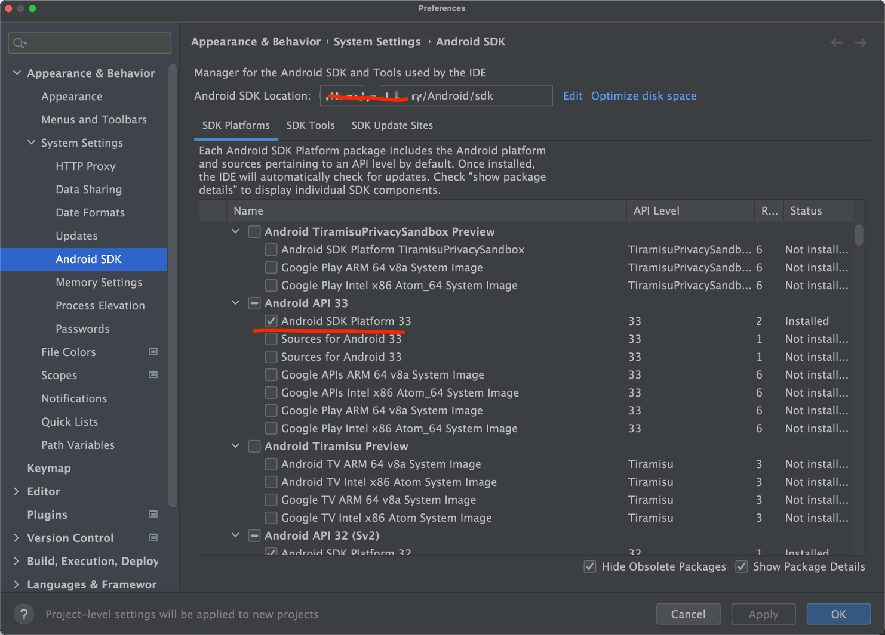
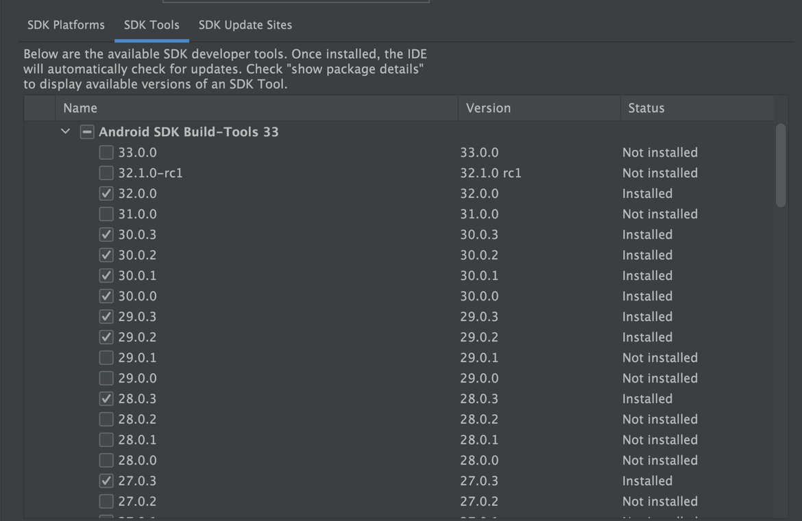
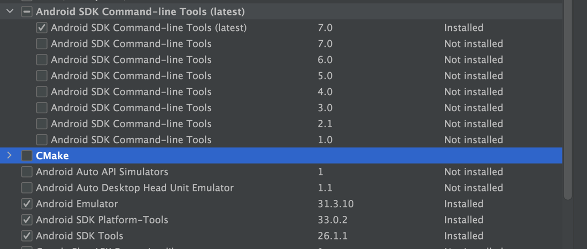

# 安装JDK 1.8
根据使用的cordova-android版本选择jdk,最新版的cordova-android需要jdk11,旧的需要1.8,现在jdk安装包一般都会自动配置好环境变量的,安装目录不要中文

# 安装gradle
按照情况选择,可以下载6.+的complete然后配置环境变量把bin目录加到path,增加GRADLE_HOME,GRADLE_USER_HOME,安装目录不要中文
https://gradle.org/install/  
https://gradle.org/releases/  
https://gradle.org/next-steps/?version=6.9&format=all  

# 安装android studio
从https://developer.android.google.cn/studio/下载最新版安装,安装目录不要中文  
在设置中找到android sdk manager 按需下载对应的sdk


根据cordova-android的版本来选取需要下载的sdk版本, 如果不清楚就把26,27,28,29,30,31,32,33的sdk都安装一遍


安装sdk build tools  
根据cordova-android的版本来选择build tools版本,最新版才支持32,33;如果使用的是旧版,不要安装32会报错,安装30.0.3即可



模拟器按需安装,但是推荐真机调试  

# node
建议使用node 14

# cordova 
```
npm i cordova@11.0.0
```